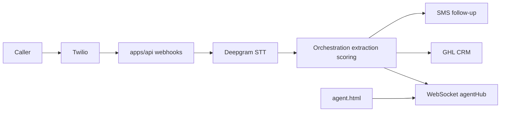

# Easy Intake — Architecture

This document describes how the system is structured **today** in this repo, with explicit gaps and goals.

---

## 1. Repository layout

```
easy-intake-app/          ← npm workspaces: apps/*, packages/*
  apps/api/               ← Express intake engine
  apps/web/               ← Next.js 14 (Clerk + i18n)
  packages/shared/
easy-intake-site/         ← Sibling static site — NOT in the workspace
```

---

## 2. Authentication (split — not all Clerk)

| Layer | Mechanism | Purpose |
|-------|-----------|---------|
| **apps/web** | **Clerk** | End-user session: sign-in/up, `auth()` / `auth.protect()` on localized routes (`/en`, `/es`). |
| **apps/api** | **HS256 JWT** (`API_JWT_SECRET`) | Bearer `Authorization` for protected HTTP routes; short-lived tokens from `/internal/token` (and similar) for **agent WebSocket** auth. Payload is **application-defined** (e.g. `sub`, `purpose`), not Clerk session claims. |

**Do not** conflate Clerk session with API JWT. Server-to-server or browser-to-API patterns that need the intake engine should use the **API's** JWT rules, not Clerk's, unless you explicitly build a bridge (not assumed here).

**Clerk roles / org claims:** If documented in product rules (e.g. `super_admin`, `org:admin`), treat **enforcement in this repo** as **partial** until verified in code or Clerk Dashboard templates.

---

## 3. Agent UI (what exists today)

| UI | Location | Role |
|----|----------|------|
| **Realtime agent dashboard (static)** | `apps/api/public/agent.html` | Connects to the API WebSocket with a JWT; shows transcript / entities / guidance during a call. **This is the current realtime agent UI.** |
| **Next.js app** | `apps/web` | Small surface: home + Clerk sign-in/up + protected shell. **Not** the full agent dashboard yet. |

---

## 4. End-to-end data flow (voice — simplified)



- **Inbound call:** Twilio hits `apps/api` voice + status webhooks; media streams feed transcription; utterances drive extraction and stage/score updates; on call end, persistence and CRM/SMS as implemented.
- **cotizarahora:** Out-of-band **HTTP POST** to `/api/webhooks/intake` per [WEBHOOK_SPEC.md](api-contract/WEBHOOK_SPEC.md); handler validates secret + source, then processes events (GHL upsert, notes, etc.).

---

## 5. Database (honest)

- **ORM:** Prisma + PostgreSQL (`apps/api/prisma/schema.prisma`).
- **Today:** Schema is **insurance vertical–shaped** (e.g. `LifeInsuranceEntity`, insurance-oriented fields). **`IntakeLead`** supports the cotizarahora webhook idempotency story.
- **Goal:** Vertical-agnostic **engine** with config-driven fields — **storage and models are not fully generalized yet.** New verticals may need schema evolution or abstraction.

---

## 6. Integration contract maintenance

**[TODO] `api-contract/WEBHOOK_SPEC.md`:** Align documented HTTP responses with **`apps/api/src/webhooks/intake.ts`**. The implementation currently returns **401, 400, 409, 200, 500** only. The spec mentions statuses such as **202** and **422** — update the documentation so senders know what to expect.

**Resolution:** Update the spec to match the handler (`401` / `400` / `409` / `200` / `500`) rather than changing the handler. Spec changes require a version bump and notification to the sending product.

---

## 7. Deployment

- **Railway:** Use **[RAILWAY-DEPLOY.md](RAILWAY-DEPLOY.md)** at the repo root as the canonical guide. [`docs/DEPLOY-RAILWAY.md`](docs/DEPLOY-RAILWAY.md) is superseded and points here.
- Local setup and env overview: [SETUP.md](SETUP.md).

---

## 8. Communication between parts

- **api ↔ web:** REST/WebSocket **as designed** for product evolution; **today** the heavy realtime path is **API + `agent.html`**, not a rich Next dashboard.
