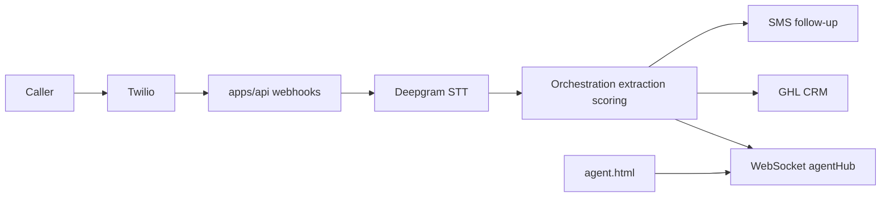

# Easy Intake — Architecture

This document describes how the system is structured **today** in this repo, with explicit gaps and goals.

---

## 1. Repository layout

```
easy-intake-app/          ← npm workspaces: apps/*, packages/*
  apps/api/               ← Express intake engine
  apps/web/               ← Next.js 14 (Clerk + i18n)
  packages/shared/
easy-intake-site/         ← Sibling static site — NOT in the workspace
```

---

## 2. Authentication (split — not all Clerk)

| Layer | Mechanism | Purpose |
|-------|-----------|---------|
| **apps/web** | **Clerk** | End-user session: sign-in/up at `/[locale]/sign-in` and `/[locale]/sign-up`, `auth()` / `auth.protect()` on localized routes (`/en`, `/es`). Middleware runs **`clerkMiddleware`** then returns **next-intl**’s middleware so auth and locale handling share one chain (see [`apps/web/src/middleware.ts`](apps/web/src/middleware.ts)). Sign-in/sign-up, legal pages, and **applicant microsite** routes **`/[locale]/apply/*`** are public; other locale routes use `auth.protect()` unless extended in code. |
| **apps/api** | **HS256 JWT** (`API_JWT_SECRET`) | Bearer `Authorization` for protected HTTP routes; short-lived tokens from `/internal/token` (and similar) for **agent WebSocket** auth. Payload is **application-defined** (e.g. `sub`, `purpose`), not Clerk session claims. |
| **Applicant microsite** | **Opaque portal token** (stored hashed in **`ApplicantPortalAccess`**) | Applicants open **`/en/apply/:token`** or **`/es/apply/:token`** on **`apps/web`** (no Clerk). The browser calls the **Next BFF** (`/api/public/intake/session`), which forwards to **`apps/api`** **`GET` / `PATCH /api/public/intake/session`** with **`Authorization: Bearer <portal_token>`**. Minting tokens is **agent-authenticated** on the API: **`POST /api/intake/sessions/:sessionId/applicant-portal-token`**. |

**Do not** conflate Clerk session, API JWT, and applicant portal tokens. Server-to-server or browser-to-API patterns that need the intake engine should use the **API's** JWT rules, not Clerk's, unless you explicitly build a bridge (not assumed here).

**Clerk roles / org claims:** If documented in product rules (e.g. `super_admin`, `org:admin`), treat **enforcement in this repo** as **partial** until verified in code or Clerk Dashboard templates.

---

## 3. Agent UI (what exists today)

| UI | Location | Role |
|----|----------|------|
| **Realtime agent dashboard (static)** | `apps/api/public/agent.html` | Connects to the API WebSocket with a JWT; shows transcript / entities / guidance during a call. **This is the current realtime agent UI.** |
| **Next.js app** | `apps/web` | Localized shell (`/en`, `/es`): home, Clerk auth, protected dashboard (**Live demo**, **Live call**, **Settings**, queue/session surfaces), localized **`/[locale]/intake/*`** (e.g. demos), and the **public applicant microsite** at **`/[locale]/apply/[token]`** (config-driven form, saves, changelog read). Session detail includes **Create applicant link**, **highlight fields for applicant** (`hitl.agentRequestedFieldKeys`), **field changelog**, and **Send reminder to complete** (SMS/email/WhatsApp via GHL or Twilio per existing follow-up configuration). **Live demo / Live call** use **`LiveDemoClient`**: agents enter the caller’s **last 4 digits**; the UI **refetches** recent calls via BFF **`GET /api/demo/twilio-calls`** (Clerk → short-lived JWT → **`GET /api/operator/twilio/recent-calls`**), matches Twilio’s **last-4-only** `from` field, then enables a per-row CTA **Connect to Call for Data Collection** (sets Call SID and opens the **agent WebSocket** to `apps/api`); **Disconnect** ends the stream. **Connect stream** remains for manual Call SID entry. **Not** the legacy static realtime-only surface — that remains **`agent.html`** on `apps/api`. |

---

## 4. End-to-end data flow (voice — simplified)



- **Inbound call:** Twilio hits `apps/api` voice + status webhooks; media streams feed transcription; utterances drive extraction and stage/score updates; on call end, persistence and CRM/SMS as implemented.
- **Agency forward / conference (optional):** When **`AgencyConfig.voiceAgentForwardNumber`** is set, the voice webhook + TwiML path may **dial** that destination and/or use a **Twilio conference** so the engine and a live agent share audio (see `twilioConference.ts`, `voice.ts`, `twiml.ts`). If unset, behavior matches the previous direct-media path for that number.
- **cotizarahora:** Out-of-band **HTTP POST** to `/api/webhooks/intake` per [WEBHOOK_SPEC.md](api-contract/WEBHOOK_SPEC.md); handler validates secret + source, then processes events (GHL upsert, notes, etc.).
- **Form catalog (draft):** Authenticated **`POST /api/intake/form-catalog/analyze-pdf`** (`formCatalog.ts`) sends a PDF to Claude and returns JSON **sections/fields** suitable for seeding a vertical package (human review required before production use).
- **Shared legal copy:** Terms/privacy JSON lives in **`packages/shared/src/legal/`** and is exported via **`@easy-intake/shared/legal/*`** for `apps/web` — single source for bilingual legal pages.
- **Applicant self-service:** Agents mint time-limited portal links; applicants update **`IntakeSession.fieldValues`** via public PATCH; each change appends **`IntakeSession.fieldChangeLog`** (shared **`FieldChangeEventV1`** shape: actor, reason, timestamp). Completeness uses **`packages/shared`** helpers (`computeCompletenessSnapshot`, vertical **`requiredFieldKeys`**). **`APPLICANT_PORTAL_BASE_URL`** on **`apps/api`** must be the **public origin of `apps/web`** so mint, copy, and reminder SMS contain usable URLs (set on the **API** host — e.g. Railway — not on Vercel).

---

## 5. Database (honest)

- **ORM:** Prisma + PostgreSQL (`apps/api/prisma/schema.prisma`).
- **Today:** Schema is **insurance vertical–shaped** (e.g. `LifeInsuranceEntity`, insurance-oriented fields). **`IntakeLead`** supports the cotizarahora webhook idempotency story. **`AgencyConfig`** includes optional **`voiceAgentForwardNumber`** for Twilio bridging. **`ApplicantPortalAccess`** stores a **hashed** portal token per intake session for the applicant microsite.
- **Goal:** Vertical-agnostic **engine** with config-driven fields — **storage and models are not fully generalized yet.** New verticals may need schema evolution or abstraction. **Immigration (N-400, etc.)** is modeled primarily in **`packages/shared`** vertical configs and **API prompts** (`uscisN400Extract`, `uscisN400Guidance`), not a second Prisma entity today.

---

## 6. Integration contract maintenance

**[TODO] `api-contract/WEBHOOK_SPEC.md`:** Align documented HTTP responses with **`apps/api/src/webhooks/intake.ts`**. The implementation currently returns **401, 400, 409, 200, 500** only. The spec mentions statuses such as **202** and **422** — update the documentation so senders know what to expect.

**Resolution:** Update the spec to match the handler (`401` / `400` / `409` / `200` / `500`) rather than changing the handler. Spec changes require a version bump and notification to the sending product.

---

## 7. Deployment

| Target | Platform | Notes |
|--------|----------|--------|
| **`apps/web`** | **Vercel** | Project **`easyintake-app-web`**. **Root Directory** = **`apps/web`**; enable **Include files outside the root directory in the Build Step** so the full monorepo is available. **[`apps/web/vercel.json`](apps/web/vercel.json)** runs **`npm ci`** at the monorepo root, then **`npm run build --workspace=@easy-intake/shared`** (writes `packages/shared/dist`; `dist` is gitignored), then **`npm run build --workspace=@easy-intake/web`**. Custom domains (e.g. `app.easyintakeapp.com`) are configured in Vercel **Domains**; **Clerk Production** may require additional DNS (e.g. `clerk`, `accounts`, email/DKIM) at the registrar — see **[`apps/web/DEPLOY-PRODUCTION.md`](apps/web/DEPLOY-PRODUCTION.md)** (**§6** describes using **Vercel Observability** read-only to compare build vs runtime spend and top routes). |
| **`apps/api`** | **Railway** | Existing deployment. Use **[RAILWAY-DEPLOY.md](RAILWAY-DEPLOY.md)** at the repo root as the canonical guide. [`docs/DEPLOY-RAILWAY.md`](docs/DEPLOY-RAILWAY.md) is superseded and points here. Set **`APPLICANT_PORTAL_BASE_URL`** to the **Next.js production origin** (same host users use for `/en/...`, e.g. `https://app.easyintakeapp.com`) so applicant link minting and reminder SMS resolve correctly — this variable is **not** required on Vercel. |
| **`easy-intake-site`** | **Vercel** | Existing deployment as a **separate** Vercel project (sibling repo path; not part of the npm workspace). |

- Local setup and env overview: [SETUP.md](SETUP.md).

---

## 8. Communication between parts

- **api ↔ web:** REST/WebSocket **as designed** for product evolution; **today** the heavy realtime path is **API + `agent.html`**, not a rich Next dashboard.

---

## 9. Central reporting hub (strategy)

Operational dashboards should use **layered reporting**: comparable facts (volume, funnel, completeness, sync health, follow-ups) plus **org config** for labels and required fields — not one global lead column set. Clerk-backed UI should use a **BFF** pattern (server routes that call the API with appropriate credentials), not assume Clerk JWTs authenticate the engine.

**Canonical doc:** [REPORTING_HUB.md](REPORTING_HUB.md) — event vocabulary, tenancy bridge, MVP widgets, drill-down contract, mapping to `Call` / `IntakeLead` / `FollowUpJob`. **Roadmap:** explicit `IntakeEvent` rows or ETL when org cardinality and query complexity grow — [DECISIONS.md](DECISIONS.md).
