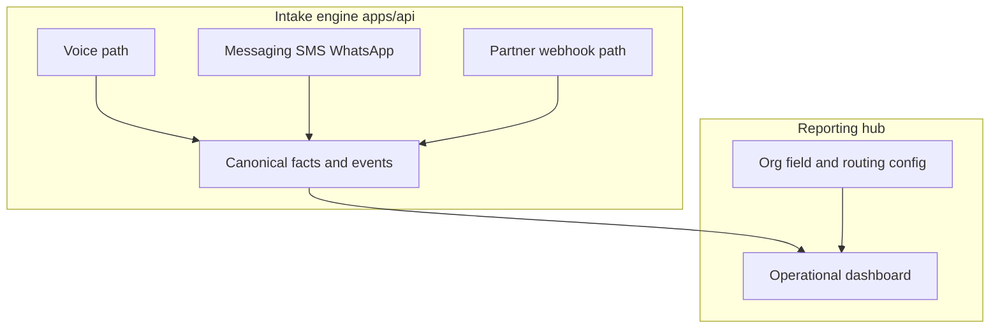

# Central reporting hub strategy

This document describes how a **cross-org operational dashboard** should work when orgs differ in vertical, field catalogs, CRM targets, and channels. It splits **engine-level comparable facts** (timelines, outcomes, funnel, sync health) from **org-specific shapes** (field catalogs, CRM mappings), and drives the UI from **org config + optional event log** rather than one global lead schema.

**Scope today:** Vocabulary, tenancy story, MVP widgets, drill-down contract, and mapping to **existing** Prisma models. A dedicated `IntakeEvent` table or warehouse ETL is **[PLANNED]** — see [DECISIONS.md](DECISIONS.md) product roadmap.

---

## Why a single “report” breaks

If the dashboard is one grid of columns for “all leads,” it conflicts with reality: orgs send data to different places (GHL vs future CRMs vs webhooks), collect different fields ([`VerticalConfig`](packages/shared/src/verticalConfig.ts) encodes vertical → organization → productType → product), and use different channels (voice vs [`IntakeLead`](apps/api/prisma/schema.prisma) webhook path). The fix is **layered reporting**, not one universal spreadsheet.

---

## Layer 1: Canonical intake facts (org-comparable)

Stable dimensions every intake shares, independent of payload shape:

| Dimension | Meaning |
|-----------|---------|
| **Identity & tenancy** | `org_id` / agency / location — align Clerk orgs with API agency concepts when the bridge exists ([DECISIONS.md](DECISIONS.md)). Today: [`AgencyConfig`](apps/api/prisma/schema.prisma) (`ghlLocationId`, Twilio routing). |
| **Channel & source** | **voice** vs **messaging** (SMS, WhatsApp, etc.) vs **partner webhook**. At ingress, messaging is a third path beside voice and webhook; all should converge on the same orchestration and canonical events. |
| **Lifecycle** | created → active → completed/failed; duration; [`FlowStage`](apps/api/prisma/schema.prisma) for voice. |
| **Quality / completion** | Normalized scores (e.g. `completenessScore`), not raw field columns. |
| **Downstream effects** | Sync attempted / succeeded / failed; **which connector** (GHL, webhook target) — counts and latency, not full CRM payload. |

**KPI backing today:** Primarily `Call`, `IntakeLead`, and `FollowUpJob`. When ad-hoc queries become too heavy or cross-org rollups need uniform milestones, add **append-only event rows** (`IntakeEvent`) or **ETL** to an analytics store — see roadmap in [DECISIONS.md](DECISIONS.md).

**Ingress nuance:** Voice and messaging are **consumer-originated** sessions. Webhook is **partner-originated** payloads. Reporting tags `channel` / `source_type` so the hub can filter and compare.

---

## Minimal event vocabulary and DB mapping

Canonical names are also defined in code as [`CANONICAL_INTAKE_EVENTS`](packages/shared/src/canonicalReportingEvents.ts) for dashboards and future instrumentation.

| Event name | Meaning | Backing in repo today | Notes |
|------------|---------|------------------------|-------|
| `intake.started` | Session / lead intake begins | `Call.startedAt`, `Call.createdAt`; `IntakeLead.createdAt` | Webhook path has no `Call`; use lead row. |
| `intake.completed` | Session completed successfully | `Call.status` = `COMPLETED`, `Call.endedAt` | |
| `intake.failed` | Session failed or abandoned | `Call.status` ∈ `FAILED`, `NO_ANSWER` | |
| `stage.advanced` | Flow stage changed | `Call.flowStage`, `Call.updatedAt` | Insurance-oriented enum today. |
| `extraction.updated` | Extraction / scoring refreshed | `Call.completenessScore`, `LifeInsuranceEntity.updatedAt` | |
| `destination.sync.attempted` | Downstream write attempted | Partially inferable from `ghlContactId` / webhook handler behavior | **Gap:** no single “attempt” timestamp column. |
| `destination.sync.completed` | Downstream write succeeded | `Call.ghlSyncedAt`, `Call.ghlContactId`; `IntakeLead.ghlContactId` | |
| `destination.sync.failed` | Downstream write failed | **Gap:** not first-class on `Call`/`IntakeLead` — use logs or future events. |
| `lead.webhook.event` | Partner webhook lifecycle | `IntakeLead.lastEvent` (`lead.captured` \| `quote.completed` \| `quote.requested_callback`) | Idempotency key: `leadId`. |
| `followup.outcome` | Scheduled follow-up result | `FollowUpJob.status`, `sentAt`, `failReason` | Tied to `Call` today. |

**Future:** Milestones emitted as **explicit rows** (e.g. `IntakeEvent`) or replicated via **ETL** for BI — see [DECISIONS.md](DECISIONS.md).

---

## Reporting tenancy (Clerk org ↔ API)

| Concept | Where it lives | Notes |
|---------|----------------|-------|
| **Browser session org** | Clerk JWT claims (`org_id`, `org_role`) — verify in Dashboard / code | Intended roles: `super_admin`, `org:admin`, `org:member`, `applicant`. |
| **Engine agency / routing** | `AgencyConfig` — `ghlLocationId`, Twilio numbers | Per-install / per-agency today. |
| **Bridge** | **[PLANNED]** Map Clerk `org_id` → `AgencyConfig` (or successor) for org-scoped reporting APIs | Until then, internal dashboards may key off agency identifiers already in the DB. |

Server routes in `apps/web` that load reports should follow a **BFF pattern**: Clerk session → server-only calls to `apps/api` with credentials the browser never holds — see [ARCHITECTURE.md](ARCHITECTURE.md) auth split.

---

## MVP widgets (operational hub)

1. **Volume by channel** — voice (`Call`) vs partner webhook (`IntakeLead`) vs messaging when wired; time-bucketed counts.
2. **Funnel / stage time** — distribution and time-in-stage from `Call.flowStage` + timestamps (voice).
3. **Completeness distribution** — histogram or buckets from `Call.completenessScore`.
4. **GHL / webhook sync health** — success rate and latency proxies: contacts with `ghlContactId` / `ghlSyncedAt` vs failures (where observable).
5. **Follow-up job outcomes** — `FollowUpJob` status mix and failure reasons.

Per-field breakdowns are **secondary** drill-downs, driven by org field catalog — not the primary aggregate grid.

---

## Drill-down contract

| Depth | What the user sees | Source |
|-------|---------------------|--------|
| **Summary** | Layer 1 KPIs + widgets above | `Call`, `IntakeLead`, `FollowUpJob`, aggregates |
| **Config-driven checklist** | “Required field completion %” **relative to that org’s required set** | [`VerticalConfig`](packages/shared/src/verticalConfig.ts) + same field-definition story as the engine |
| **Vertical / domain payload** | Detailed collected facts | **Today:** `LifeInsuranceEntity` linked to `Call`. **Future:** JSON keyed by field ids + registry — still roll up Layer 1 metrics, not hundreds of nullable global columns |

Destination-native reporting (e.g. GHL reports) remains the home for **contact/opportunity** analytics; the hub emphasizes **engine** KPIs, gaps, sync failures, and stuck stages.

---

## Optional: warehouse / BI

Stream Layer 1 facts or events to BigQuery, Snowflake, etc., for customers who want SQL across orgs. Keep **PII policy** explicit and separate from operational dashboards.

---

## Stress test: SMS/WhatsApp + non-insurance vertical

Layer 1 stays coherent: sessions by channel, timelines (first touch → qualified → destination), completion scores per vertical config, sync health. Layer 2–3 change with **vertical config** and domain storage — not the hub’s widget shape. Messaging is modeled as **conversation/thread** in the engine over time; the hub exposes `channel` labels while the engine owns the pipe.

---

## Related docs

- [ARCHITECTURE.md](ARCHITECTURE.md) — auth split, data flow, deployment.
- [CONTEXT.md](CONTEXT.md) — product boundaries and vertical-agnostic goal.
- [DECISIONS.md](DECISIONS.md) — roadmap including explicit events / ETL.
- [`canonicalReportingEvents`](packages/shared/src/canonicalReportingEvents.ts) — stable event name constants.
